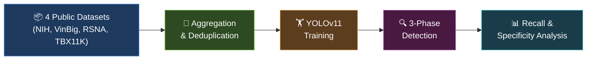

# YOLOv11 Medical Chest X-ray Detection Pipeline

An end-to-end, modular pipeline for **preparing, training, and deploying YOLOv11** on chest X-ray datasets. Covers dataset aggregation from four public sources, intelligent bounding-box deduplication, advanced training with GPU management, high-recall inference with TTA, and a three-phase lung disease detection pipeline (YOLO → Segmentation → Classification).

## Pipeline Architecture



## Table of Contents

- [Detected Pathologies](#detected-pathologies)
- [Quick Start](#quick-start)
- [Installation](#installation)
- [Usage](#usage)
- [Datasets](#datasets)
- [Key Features](#key-features)
- [Training](#training)
- [Results](#results)
- [Project Structure](#project-structure)
- [Abstract](#abstract)
- [Citation](#citation)
- [Contributing](#contributing)
- [License](#license)
- [Acknowledgments](#acknowledgments)

## Detected Pathologies

| Class | Sources | Annotation Type |
|-------|---------|-----------------|
| **Lung Cancer** (nodules / masses) | VinBigData, NIH ChestX-ray14 | Real bbox annotations |
| **Pneumonia** | RSNA Pneumonia Challenge, VinBigData | Real bbox annotations |
| **Tuberculosis** | TBX11K, VinBigData, NIH ChestX-ray14 | Real bbox annotations |

## Quick Start

```bash
git clone https://github.com/sireiw/YOLOv11-Medical-Chest-X-ray.git
cd yologithub
pip install -r requirements.txt
```

Then run the notebook `prepare_dataset.ipynb` on **Kaggle** (recommended) or configure local paths — see [Usage](#usage) below.

## Installation

```bash
pip install -r requirements.txt
```

### Requirements

- Python ≥ 3.8
- PyTorch ≥ 2.0
- [Ultralytics](https://docs.ultralytics.com/) (YOLOv11)
- See [`requirements.txt`](requirements.txt) for the full dependency list.

## Usage

### On Kaggle (Recommended)

The pipeline is designed for the Kaggle notebook environment where datasets are mounted at `/kaggle/input/`. Simply run the notebook `prepare_dataset.ipynb`.

### Locally

Override dataset paths in the config:

```python
from src.config import DatasetConfig
from src.pipeline import DatasetPreparationPipeline

config = DatasetConfig(
    output_dir="./yolov11_dataset",
    nih_base_path="/path/to/nih",
    vinbig_base_path="/path/to/vinbig",
    rsna_base_path="/path/to/rsna",
    tbx11k_base_path="/path/to/tbx11k",
)
pipeline = DatasetPreparationPipeline(config)
pipeline.run()
```

## Datasets

Download and mount the following Kaggle datasets:

| Dataset | Link |
|---------|------|
| NIH ChestX-ray14 | [kaggle.com/datasets/nih-chest-xrays/data](https://www.kaggle.com/datasets/nih-chest-xrays/data) |
| VinBigData | [kaggle.com/c/vinbigdata-chest-xray-abnormalities-detection](https://www.kaggle.com/c/vinbigdata-chest-xray-abnormalities-detection) |
| RSNA Pneumonia | [kaggle.com/c/rsna-pneumonia-detection-challenge](https://www.kaggle.com/c/rsna-pneumonia-detection-challenge) |
| TBX11K | [kaggle.com/datasets/usmanshams/tbx11k-simplified](https://www.kaggle.com/datasets/usmanshams/tbx11k-simplified) |

> **Note:** On Kaggle, add each dataset to your notebook via *Add Data*. For local use, download and update the paths in `DatasetConfig`.

## Key Features

- **Guaranteed target count** — processes extra images to meet the per-class target (default: 1,000)
- **Patient-level splitting** — prevents data leakage between train / val / test
- **Advanced deduplication** — per-disease thresholds using GIoU, DIoU, CIoU, Soft-NMS, and clustering
- **DICOM support** — automatic windowing and conversion to PNG
- **Checkpoint / resume** — saves state for interrupted runs
- **Debug visualisation** — before / after dedup images saved automatically
- **Three-phase detection** — YOLO detection → segmentation → classification pipeline

## Training

After dataset preparation, train with [Ultralytics](https://docs.ultralytics.com/):

```python
from ultralytics import YOLO

model = YOLO("yolov11m.pt")
results = model.train(
    data="./yolov11_dataset/dataset.yaml",
    epochs=100,
    imgsz=640,
    batch=16,
    patience=50,
    optimizer="AdamW",
    device=0,
)
```

Pre-trained weights are provided in `weightyolo11_100epoc/` (`best.pt` and `last.pt`).

## Results

> _Replace the placeholder values below with your actual metrics._

| Metric | Lung Cancer | Pneumonia | Tuberculosis | Overall |
|--------|:-----------:|:---------:|:------------:|:-------:|
| **mAP@0.5** | 0.XX | 0.XX | 0.XX | 0.XX |
| **mAP@0.5:0.95** | 0.XX | 0.XX | 0.XX | 0.XX |
| **Recall** | 0.XX | 0.XX | 0.XX | 0.XX |
| **Precision** | 0.XX | 0.XX | 0.XX | 0.XX |

<!--
### Sample Detections

Add sample detection images here:

-->

## Project Structure

```
yologithub/
├── src/
│   ├── __init__.py              # Package init
│   ├── config.py                # DatasetConfig dataclass & constants
│   ├── bbox_dedup.py            # Bounding-box deduplication (GIoU/DIoU/CIoU/Soft-NMS)
│   ├── pipeline.py              # DatasetPreparationPipeline + main()
│   ├── visualization.py         # Dataset display utilities
│   ├── gpu_utils.py             # GPU memory management
│   ├── training.py              # YOLOv11 training pipeline + early stopping
│   ├── inference.py             # High-recall inference with TTA
│   ├── display_results.py       # Detection result display / annotation
│   ├── resume_training.py       # Resume / continue training from checkpoints
│   ├── training_viz.py          # Training loss visualisation
│   ├── diagnostics.py           # Label quality diagnostics
│   ├── metrics.py               # Recall / specificity analysis
│   ├── models.py                # UNet + EfficientNet neural networks
│   └── three_phase_pipeline.py  # 3-phase detection pipeline
├── weightyolo11_100epoc/        # Trained model weights
│   ├── best.pt
│   └── last.pt
├── prepare_dataset.ipynb        # Slim notebook
├── requirements.txt
├── LICENSE                      # MIT License
├── .gitignore
└── README.md
```

## Abstract

This project addresses the challenge of building a robust multi-class pathology detector for chest X-ray images. By aggregating annotations from four heterogeneous public datasets (VinBigData, NIH ChestX-ray14, RSNA, TBX11K), the pipeline produces a unified, balanced training set suitable for state-of-the-art YOLOv11 object detection. Special attention is given to annotation quality through a multi-stage bounding-box deduplication strategy that accounts for disease-specific lesion morphology.

**Keywords:** YOLOv11 · Chest X-ray · Object Detection · Medical Imaging · Lung Cancer · Pneumonia · Tuberculosis · Dataset Preparation · Bounding-box Deduplication

## Citation

If you find this work useful, please consider citing:

```bibtex
@misc{yolov11chestxray2026,
  title   = {YOLOv11 Medical Chest X-ray Detection Pipeline},
  author  = {sireiw},
  year    = {2026},
  url     = {https://github.com/sireiw/YOLOv11-Medical-Chest-X-ray}
}
```

## Contributing

Contributions are welcome! Please open an issue first to discuss proposed changes, then submit a pull request.

1. Fork the repository
2. Create a feature branch (`git checkout -b feature/my-feature`)
3. Commit your changes (`git commit -m "Add my feature"`)
4. Push to the branch (`git push origin feature/my-feature`)
5. Open a Pull Request

## License

This project is licensed under the **MIT License** — see the [LICENSE](LICENSE) file for details.

## Acknowledgments

- [Ultralytics](https://ultralytics.com/) for the YOLOv11 framework
- [NIH Clinical Center](https://nihcc.app.box.com/v/ChestXray-NIHCC) for ChestX-ray14
- [VinBigData](https://vinbigdata.com/) for the chest X-ray abnormalities dataset
- [RSNA](https://www.rsna.org/) for the Pneumonia Detection Challenge
- [TBX11K](https://mmcheng.net/tb/) dataset maintainers
